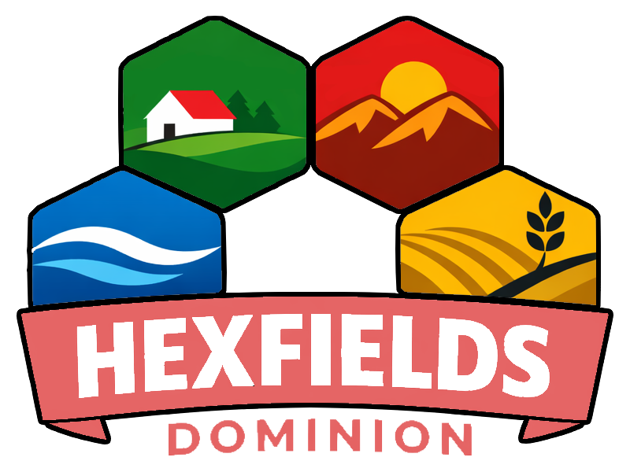

<p align="center">
    
    <br />
    
</p>

This is the frontend for our game **Hexfields: Dominion**, an online alternative to the board game *The Settlers of Catan*.

Players are supposed to access this via the browser. This code is not meant for installation, rather just for development and deployment.

The game is hosted on a [GitHub Pages Website](https://hexfields-studio.github.io/HexfieldsDominion/).

It might take some minutes until the backend responds as it has to start up again after some time of not being used.

## 🛠️ Development

To start the dev server:

```bash
git clone git@github.com:Hexfields-Studio/HexfieldsDominion.git
cd HexfieldsDominion
bun install
bun run dev
```
